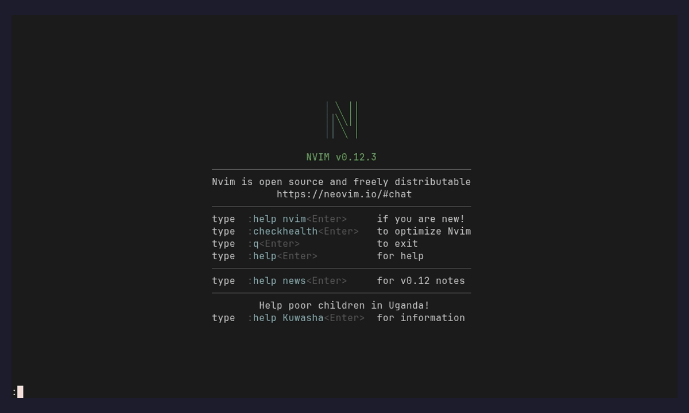
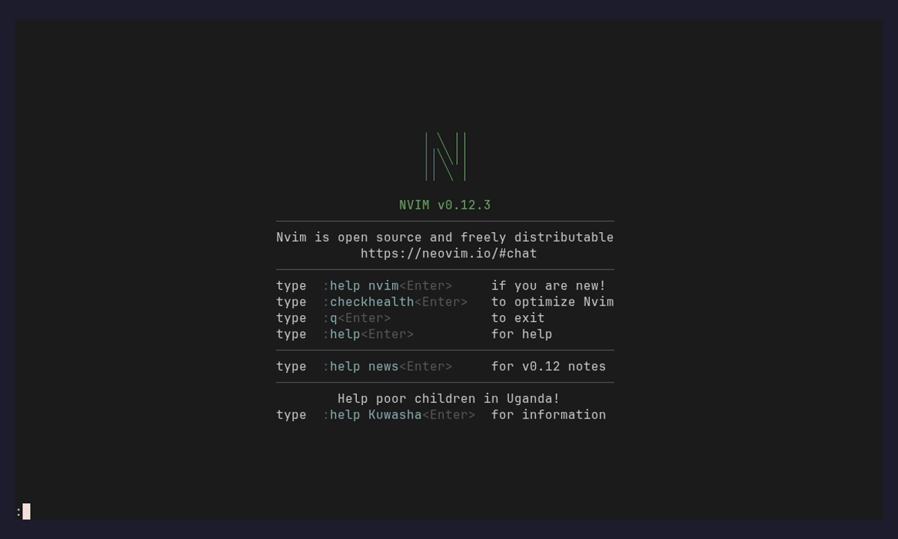

# beads.nvim

Neovim UI for [beads](https://github.com/gastownhall/beads) (`bd`) — the
dependency-first issue tracker. Browse and filter issues in Telescope, edit
them in a floating detail view, and walk dependency chains without leaving the
editor.


## How it works

beads.nvim is a front end for the `bd` CLI; `bd` is the single source of truth,
and the plugin keeps no issue state of its own. Reads go through `bd … --json`
and writes through `bd update`, `bd comment`, and the like, so every change you
make in the UI is an ordinary `bd` mutation you could have run by hand. Calls
run asynchronously through `vim.system`, and each view fetches once and filters
in memory instead of shelling out per keystroke. The detail view takes this one
step further: it is the issue's description as a real buffer, and `:w` writes it
back with `bd update --body-file -`.

State, history, and sync are bd's concern, not the plugin's. Issues live in a
local Dolt database and sync over `refs/dolt/data` on your git remote; see bd's
[sync model](https://github.com/gastownhall/beads/blob/main/docs/SYNC_CONCEPTS.md)
for the details beads.nvim deliberately does not reimplement.

## Examples

Short clips of the common flows (synthetic demo data — no personal tracking on
screen). Each is rendered headlessly by the `recording/` pipeline.

### Browse and filter


`:Beads` opens a Telescope picker over `bd list`. Cycle the status / priority /
type / label filters (`<C-s>`, `<C-y>`, `<C-t>`, `<C-l>`) or type to filter by
text — one fetch, client-side filtering, no subprocess per keystroke.

### Create an issue


`:BeadsCreate` walks a quick form — title → type → priority → dependencies —
then drops you into the new issue's detail view. (`:BeadsQuick` is the one-line
version.)

### Open and edit



Selecting an issue opens its description as a real, always-editable buffer:
every vim keybind works, and `:w` persists the change via `bd update`.

### Change status and act on an issue



`<Tab>` jumps to the sidebar, where the Actions rows drive the issue — press
`s` to change status (and `p` priority, `a` comment, `c` close, …), each a
single keystroke, with the change logged in the issue's history.

### Project status at a glance


`:BeadsDashboard` summarises the project from `bd stats` — open / in progress /
blocked / closed counts, ready work, and total — and each row jumps into that
filter.

### Issues as a kanban board

`:BeadsBoard` lays every issue out as status columns — open, in progress,
blocked, and closed by default (configurable). `h`/`l` move between columns,
`j`/`k` within one, `<CR>` opens the detail view, and `s` moves a card to
another status.

### Walk the dependency graph


From the sidebar, `D` opens the dependency graph for the issue; `a` toggles to
the all-issues view, and `gd` follows any id straight to its issue.

## Features

- **Issue browser** — Telescope picker over `bd list` with live filter
  cycling (status / priority / type / label / include-closed) and a rendered
  issue preview. No subprocess per keystroke: one fetch, client-side
  filtering. `<C-f>` defers/undefers the selected issue.
- **Ready view** — `bd ready` (open issues with no active blockers).
- **Editable detail view** — the detail float IS the issue's description as a
  real, always-editable buffer: every vim (and user) keybind works — `a`
  appends, `o` opens a line, `q` records macros. `:w` persists via
  `bd update --body-file -`, `:q`/`:wq`/`ZZ` save and close. Optional autosave
  and persistent undo (see `edit` config). Set
  `view = { editable_description = false }` for the legacy read-only detail
  view with single-key actions and the `e` edit submode.
- **Issue sidebar** — companion pane beside the detail view: overview
  (status/priority/assignee/labels/dates), an **Actions** section (change
  status/priority, comment, labels, assign, defer/undefer, close/reopen,
  graph, history — run a row with `<CR>`, or press its single key — `s`, `p`,
  `a`, `L`, `A`, `f`, `c`/`o`, `D`, `H` — while the sidebar is focused), plus
  parent, children, depends_on, blocks, comments, and recent history, every
  id jumpable (`gd` / `<CR>`, `<BS>` history). `<Tab>` switches panes, `gs`
  toggles it.
- **Labels** — the `labels` action adds or removes labels (pick an existing
  one or type a new); `<C-l>` filters the browser by label.
- **Epic children** — epics list their children in the sidebar (every child
  id jumpable); `:BeadsPalette` → `epic status` shows completion per epic.
- **Change history** — the `history` action shows the issue's tracked-field
  transitions (status/priority/assignee/title/type/description) in a float;
  the last few changes render inline in the sidebar.
- **Create** — `:BeadsCreate` interactive form (title/type/priority/deps) or
  `:BeadsQuick` quick capture wrapping `bd q`.
- **Command palette** — `:BeadsPalette` runs repo-level commands
  (`status`, `epic status`, `ready`, `blocked`, `stale`, `lint`, `preflight`,
  `doctor`, `find-duplicates`, `orphans`, `dep cycles`, `diff`, `init`, …)
  with output in a float.
- **Help bar** — every pane shows its keybinds: floats render them in the
  window footer, the picker in its prompt title.
- **Resize-aware floats** — view/edit/palette floats re-center when the
  terminal size changes (tmux pane resize or zoom).
- **Link styling** — jumpable dependency ids render underlined
  (`BeadsLink`, default-linked to `Underlined`).
- **Comments** — issue comments render in the sidebar; the `comment` action
  (`a` while the sidebar is focused) adds one (`bd comment --stdin`).
- **Dependency graph** — `D` in the detail view (or `:BeadsGraph [id]`)
  shows `bd graph <id> --compact` in a float; ids are links, `gd` opens
  them. `a` toggles between the single-issue graph and the all-issues
  graph (`bd graph --all --compact`). The `<leader>bd`-menu `g` entry opens
  the all-issues graph directly (no id needed); set `graph.scope = "all"`
  to default the float to all-issues.
- **Live search** — `:BeadsSearch` re-queries `bd search` per keystroke,
  covering description text the cached picker can't; `<C-a>` includes
  closed issues.
- **Memories** — `:BeadsMemories` browses the bd memory store; `<CR>` edits
  in a float (`:w` → `bd remember`), `<C-n>` creates, `<C-d>` forgets.
- **Home dashboard** — `:BeadsDashboard` (or the `<leader>bd` menu `h`) shows
  project status counts, ready, and total from `bd stats`; press `o`/`i`/`b`/`d`
  to jump into that status filter, `r` for ready, `q` to close.
- **Kanban board** — `:BeadsBoard` (or the `<leader>bd` menu `k`) groups every
  issue into status columns; `h`/`l` switch columns, `<CR>` opens detail, and
  `s` moves a card to another status.
- **Wisps** — `:BeadsWisps` (or the `<leader>bd` menu `w`) lists bd's ephemeral
  agent-runtime issues grouped by type; `p` promotes one to a permanent bead
  (`bd promote`). Niche — most users never need it.

## Requirements

- Neovim ≥ 0.10 (`vim.system`)
- [beads](https://github.com/gastownhall/beads) (`bd`) on `$PATH`
- [telescope.nvim](https://github.com/nvim-telescope/telescope.nvim)
  (+ plenary)
- Optional: [nvim-treesitter](https://github.com/nvim-treesitter/nvim-treesitter)
  with the `markdown` parser — the detail and description-edit buffers set
  `filetype=markdown`, so installing it gives richer syntax highlighting and
  lets your markdown autoformatters run on `:w`. The plugin works fully without
  it (it ships its own `Beads*` highlights).

## Installation

First install [`bd`](https://github.com/gastownhall/beads) and confirm it is on
your `$PATH` (`bd version` — tested against 1.0.4). Then add the plugin with your
package manager. Every snippet does the same three things: put the plugin on the
runtimepath with its telescope + plenary dependencies, call
`require("beads").setup()`, and load the Telescope extension.

### lazy.nvim

```lua
{
  "tomfordweb/beads.nvim",
  dependencies = {
    "nvim-telescope/telescope.nvim",
    "nvim-lua/plenary.nvim",
  },
  config = function()
    require("beads").setup({ keymaps = true })
    require("telescope").load_extension("beads")
  end,
}
```

### packer.nvim

```lua
use({
  "tomfordweb/beads.nvim",
  requires = {
    "nvim-telescope/telescope.nvim",
    "nvim-lua/plenary.nvim",
  },
  config = function()
    require("beads").setup({ keymaps = true })
    require("telescope").load_extension("beads")
  end,
})
```

### vim-plug

Declare the plugins in your `init.vim`/`init.lua`:

```vim
Plug 'nvim-lua/plenary.nvim'
Plug 'nvim-telescope/telescope.nvim'
Plug 'tomfordweb/beads.nvim'
```

Then, after `plug#end()`, run the setup in a `lua` block:

```lua
require("beads").setup({ keymaps = true })
require("telescope").load_extension("beads")
```

### mini.deps

```lua
local add = MiniDeps.add
add({
  source = "tomfordweb/beads.nvim",
  depends = {
    "nvim-telescope/telescope.nvim",
    "nvim-lua/plenary.nvim",
  },
})
require("beads").setup({ keymaps = true })
require("telescope").load_extension("beads")
```

After installing, run `:checkhealth beads` to verify `bd` and the dependencies
are wired up. Then open Neovim in a repo with a `.beads` store (or run
`:BeadsPalette` → `init`) and run `:Beads` to browse — `<CR>` opens an issue,
`<Tab>` toggles its sidebar, `gd` follows a dependency.

## Configuration

All keys optional; shown with defaults. Tables deep-merge, so override only
what you need.

```lua
require("beads").setup({
  bd_bin = "bd",            -- path to the bd binary
  cwd = nil,                -- nil: walk up from current buffer for .beads/
  sync_timeout_ms = 5000,   -- kill a hung synchronous bd call after this long
  list_limit = 200,         -- bd list -n
  default_filters = { status = nil, priority = nil, type = nil, all = false },

  picker = {
    theme = "ivy",          -- "ivy" | "dropdown" | "cursor" | false (your telescope defaults)
    theme_opts = {},        -- passed to the theme builder (e.g. { layout_config = { height = 0.4 } })
    telescope = {},         -- raw telescope picker opts, merged last
  },

  keymaps = true,           -- false (default), true, or { base, menus } — global leader maps

  -- in-pane mappings, keyed action -> key. A value may be a string, a list
  -- of equivalent keys, or false to disable. Partial overrides merge; an
  -- overridden value replaces the default wholesale. The `view` action keys
  -- (status/priority/comment/…) run from the SIDEBAR when it is focused (the
  -- editable description buffer keeps every key's native vim meaning); with
  -- view.editable_description=false they bind on the detail buffer itself.
  mappings = {
    picker   = { open = "<CR>", status = "<C-s>", priority = "<C-y>", type = "<C-t>", label = "<C-l>",
                 defer = "<C-f>", closed = "<C-a>", refetch = "<C-r>" },
    view     = { edit = "e", status = "s", priority = "p", comment = "a", labels = "L", assign = "A",
                 defer = "f", close = "c", reopen = "o", graph = "D", history = "H",
                 jump = { "gd", "<CR>" }, back = "<BS>", refresh = "R", quit = { "q", "<Esc>" },
                 sidebar = "<Tab>", sidebar_toggle = "gs" },
    sidebar  = { jump = { "gd", "<CR>" }, focus_view = "<Tab>", back = "<BS>", quit = { "q", "<Esc>" } },
    memories = { edit = "<CR>", new = "<C-n>", forget = "<C-d>", refetch = "<C-r>" },
    graph    = { jump = { "gd", "<CR>" }, scope = "a", quit = { "q", "<Esc>" } },
  },

  icons = {
    status = { open = "○", in_progress = "◐", blocked = "⊘", deferred = "❄", closed = "●" },
    deps_down = "↓",        -- "blocks N" column arrow
    deps_up = "↑",          -- "blocked by N" column arrow
  },

  -- Dependency-graph float scope (distinct from float.graph sizing below).
  -- "issue" graphs a single id; "all" graphs every open issue. Toggle in
  -- place with the graph `scope` key (default `a`).
  graph = { scope = "issue" },

  -- Float sizes. width/height accept a fraction (0–1 = % of the editor), a
  -- "<n>%" string, or an absolute cell count (>1). Unset heights stay
  -- content-sized.
  float = {
    border = "rounded",                  -- any nvim_open_win border
    view = { width = 0.8, height = 0.8 },
    edit = { width = 0.7, height = 0.6 },-- also the memory edit float
    palette = { width = 0.7 },           -- height content-sized
    graph = { width = 0.8 },             -- height content-sized
  },

  -- detail-view shape: true (default) = the detail float is the description
  -- as a real editable buffer; false = legacy read-only view + `e` submode
  view = { editable_description = true },

  -- description-editor behavior (applies to the editable detail buffer and,
  -- in legacy mode, the `e` inline-edit submode)
  edit = {
    inline = true,              -- false: use the separate edit float instead
    discard_on_quit = false,    -- :q saves before returning; true discards
    autosave = false,           -- debounced save while typing
    autosave_debounce_ms = 800,
    persistent_undo = false,    -- keep undo history across edit sessions
    undodir = nil,              -- defaults to stdpath("state")/beads/undo
    guard_keys = {},            -- normal-mode keys to neutralize in the editor
                                -- only (e.g. { "-" } to tame oil.nvim mid-edit)
    osc52 = false,              -- opt-in: route "+/"* through OSC52 over SSH/tmux
                                -- when no clipboard provider exists (see :checkhealth)
  },

  -- issue sidebar next to the detail view (overview, actions, links, comments)
  sidebar = {
    enabled = true,         -- false: hidden until summoned with gs / <Tab>
    width = 34,
    position = "right",     -- "left"
    -- section order; remove entries to hide them. "actions" holds the
    -- runnable action rows; "comments" the thread; "history" surfaces the
    -- last `history_limit` change rows inline (full log on the history action).
    sections = { "overview", "parent", "children", "depends_on", "blocks",
                 "comments", "history", "actions" },
    history_limit = 3,
  },

  helpbar = true,           -- false: no keybind footers / prompt-title help
  notify = true,            -- false: silence success messages (errors always shown)
  refresh_on_focus = true,  -- re-center floats on tmux reattach/zoom (focus events)
  debug = false,            -- log float resize/focus events via vim.notify(DEBUG)
  palette = { extra = {} }, -- extra palette entries { label=..., args={...} }

  -- lifecycle hooks (errors are caught and surfaced via vim.notify)
  hooks = {
    on_open = nil,          -- function(issue) — fires once when the detail view
                            -- first opens an id (not on internal refreshes)
  },
})
```

#### Customizing the sidebar

- `sidebar.enabled = false` makes it on-demand: `gs` (or `<Tab>`) in the
  detail view summons it; the visibility choice then sticks while you jump
  around, until the view closes.
- Reorder or drop `sections` — e.g. `{ "children", "depends_on", "blocks" }`
  skips the overview block entirely.
- `width`/`position` resize and flip it; on narrow terminals the sidebar
  shrinks before the detail view does.
- Remap pane keys via `mappings.view.sidebar` / `mappings.view.sidebar_toggle`
  / `mappings.sidebar` (set a value to `false` to disable that key).
- It reuses `BeadsLink`, `BeadsSection`, `BeadsMeta` and the status highlight
  groups, so colorscheme overrides apply automatically.

The same table can be passed through telescope instead (merges with
`setup()`, either order):

```lua
require("telescope").setup({
  extensions = { beads = { picker = { theme = "dropdown" } } },
})
```

### Highlight groups

All groups are `default`-linked, so your colorscheme wins automatically; to
override one explicitly use
`vim.api.nvim_set_hl(0, "BeadsSection", { link = "Keyword" })` (or any attrs).

| Group | Default link | Used for |
|-------|--------------|----------|
| `BeadsTitle` | `Title` | issue titles |
| `BeadsId` | `Identifier` | issue ids |
| `BeadsSection` | `Function` | sidebar section headers |
| `BeadsMeta` | `Comment` | dates, labels, muted rows |
| `BeadsLink` | `Underlined` | jumpable dependency ids |
| `BeadsHelp` | `NonText` | help-bar text |
| `BeadsHelpKey` | `Special` | help-bar keys |
| `BeadsStatusOpen` | `DiagnosticInfo` | status: open |
| `BeadsStatusInProgress` | `DiagnosticWarn` | status: in_progress |
| `BeadsStatusBlocked` | `DiagnosticError` | status: blocked |
| `BeadsStatusClosed` | `Comment` | status: closed |
| `BeadsStatusDeferred` | `NonText` | status: deferred |

### Events

`User` autocmds fire after successful mutations, for statusline refreshes etc.:

```lua
vim.api.nvim_create_autocmd("User", {
  pattern = "BeadsIssueUpdated", -- data = { id, action = "create"|"update"|"status"|"priority"|"assign"|"label"|"defer"|"undefer"|"close"|"reopen"|"comment" }
  callback = function(ev) ... end,
})
-- also: BeadsMemoryUpdated — data = { key, action = "remember"|"forget" }
```

### tmux

Floats re-center on terminal resize and on focus-resume (tmux reattach or
pane-zoom, which often report `FocusGained`/`VimResume` rather than
`VimResized`). For the focus events to reach Neovim, enable focus reporting in
`~/.tmux.conf`:

```sh
set -g focus-events on
set -g set-clipboard on   # also lets yanks reach the system clipboard (OSC52)
```

Set `refresh_on_focus = false` to track resize only, or `debug = true` to log
each resize/focus event (`:messages`) when diagnosing layout glitches.

### Statuses and types

Filter cycles and select prompts use `bd statuses` / `bd types` (fetched once
per session), so custom types configured in bd appear automatically.

### Keymaps

Keymaps are a prefix (`base`) plus single-key `menus`. `keymaps = true` is
shorthand for:

```lua
keymaps = {
  base = "<leader>bd",
  menus = {
    l = "browse",      -- all non-closed issues
    a = "all",         -- every issue, closed included
    o = "open",        -- status:open only
    i = "in_progress", -- status:in_progress
    b = "blocked",     -- status:blocked
    d = "closed",      -- status:closed ("done")
    r = "ready",       -- unblocked work
    c = "create",      -- interactive create form
    q = "quick",       -- quick capture (bd q)
    p = "palette",     -- command palette
    m = "memories",    -- memory browser
    s = "search",      -- live bd search
    g = "graph",       -- dependency graph (id under cursor, else all-issues)
  },
}
```

Menu values are builtin action names, a function, or `{ desc, fn }`:

```lua
keymaps = {
  base = "<leader>b",
  menus = {
    i = "all",          -- every issue, closed included
    o = "open",
    w = "in_progress",
    x = { desc = "show epic", fn = function() require("beads.view").open("myproj-x9s") end },
  },
}
```

Builtin actions: `browse`, `all`, `open`, `in_progress`, `blocked`,
`closed`, `ready`, `create`, `quick`, `palette`, `memories`, `search`,
`graph`.

## Usage

Commands: `:Beads`, `:BeadsReady`, `:BeadsShow <id>`, `:BeadsCreate`,
`:BeadsQuick [title]`, `:BeadsPalette`, `:BeadsMemories`, `:BeadsDashboard`,
`:BeadsBoard`, `:BeadsWisps`, `:BeadsSearch [text]`, `:BeadsGraph [id]`. Also `:Telescope beads
beads|ready|search|memories`.

### Picker mappings

| Key | Action |
|-----|--------|
| `<CR>` | open detail view |
| `<C-s>` | cycle status filter |
| `<C-y>` | cycle priority filter |
| `<C-t>` | cycle type filter |
| `<C-a>` | toggle closed issues |
| `<C-r>` | refetch from bd |

### Detail view mappings

| Key | Action |
|-----|--------|
| `e` | edit description in place (`:w` save · `:wq` save+back · `:q` back) |
| `s` / `p` | set status / priority |
| `a` | add a comment |
| `c` / `o` | close / reopen |
| `D` | dependency graph float (`a` toggles issue ↔ all-issues) |
| `gd` or `<CR>` | jump to dependency under cursor |
| `<Tab>` | focus the links sidebar (opens it if hidden) |
| `gs` | toggle the links sidebar |
| `<BS>` | back through jump history, then back to the picker |
| `R` | refresh |
| `q` / `<Esc>` | close (returns to the picker when opened from it) |

### Sidebar mappings

| Key | Action |
|-----|--------|
| `gd` or `<CR>` | open the issue under cursor in the detail view |
| `<Tab>` | focus back to the detail view |
| `<BS>` | back through jump history |
| `q` / `<Esc>` | close the detail view (sidebar included) |

### Memories picker mappings

| Key | Action |
|-----|--------|
| `<CR>` | edit memory in a float (`:w` → `bd remember`) |
| `<C-n>` | new memory (prompts for key) |
| `<C-d>` | forget memory (confirms) |
| `<C-r>` | refetch |

### Custom in-pane actions

Any `mappings.view` or `mappings.picker` entry whose name is **not** a builtin
action may be a `{ key, fn, desc }` table. The key (a string or list, same as
any lhs) binds inside that pane, and `fn` is called with the current issue —
`state.issue` in the detail view, the selected entry in the picker. Builtins win
on name collision, and errors are caught and surfaced via `vim.notify`.

```lua
require("beads").setup({
  mappings = {
    view = {
      -- press `t` in the detail view to spin up a tmux window for the issue,
      -- mark it in_progress, and drop into a shell there
      tmux = {
        key = "t",
        desc = "tmux window",
        fn = function(issue)
          vim.system({
            "tmux", "new-window", "-n", issue.id,
            "bd update " .. issue.id .. " -s in_progress; $SHELL",
          })
        end,
      },
    },
  },
})
```

### Lifecycle hooks

`hooks.on_open(issue)` fires once when the detail view first opens an id — not
on internal refreshes — so you can sync external state (a tmux window title, a
status line, etc.) to whatever issue you're viewing:

```lua
require("beads").setup({
  hooks = {
    on_open = function(issue)
      vim.g.beads_current = issue.id
    end,
  },
})
```

## Tests

```sh
nvim --headless --noplugin -u tests/minimal_init.lua \
  -c "PlenaryBustedDirectory tests/ {minimal_init = 'tests/minimal_init.lua'}"
```

Unit suites run without bd; the integration suite exercises a real bd binary
against a throwaway database in a tmpdir and is skipped when bd is absent.
Set `PLENARY_DIR` if plenary.nvim is not at the default lazy.nvim path.

## License

MIT
